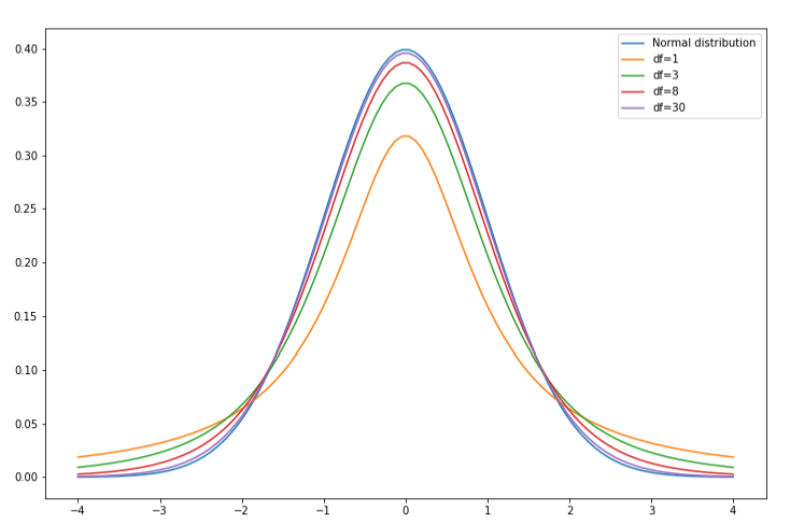

# H0 Introductie

## Leerdoelstellingen

- Beschrijvende statistieken

- Datavisualisatie

- Waarschijnlijkheid

- bivariante analyse

- tijdserie analyse

## cursusinhoud

- inleiding steekproeven
- univariate analyse
- Waarschijnlijkheid, centrale limiet theorie, statische testen
- bivariante analyse: qualitatieve variabelen
- bivariante analyse: qualitatieve vs quantitatieve variabelen
- bivariante analyse: quantitatieve variabelen
- tijdserie analyse

## Datavisualisatie kan leugens bevatten

- datavisualisatie fouten zijn
  - mediakanalen, politici, speciale groepen, louche mensen op FB die objectieve data verkeerd interpreteren of misrepresenteren. Om hun punt over te brengen.

## Waarom DataScience?

- hoeveelheid data is aan het exploderen
- data drijft bedrijfsbeslissingen
- correcte analyse is belangrijk!
- tools en data is meer bereikbaar dan ooit te voren

# H1 Basisbegrippen en steekproefonderzoek

## Basisconcepten en steekproefonderzoek

### Wetenschappelijke methode

gebaseerd op empirisch onderzoek we zijn geintereseerd in:

- exploratie
- descriptie
- voorspelling
- verificatie

### Onderzoeks process

PROBLEEMSTELLING
Wat is de onderzoeksvraag?

EXACTE INFORMATIENODEN
Wat moeten we onderzoeken?

UITVOERING RESEARCH
Enquetes, simulaties, experimenten ...

PROCESS DATA
Statische software

ANALYSEER DATA
Statische methode

FORMULEER CONCLUSIE
Schrijf research rapport

## Variabelen en Waarden

Variabele:
Algemene eigenschap van een object, die het mogelijk maakt objecten te onderscheiden

Waarde:
Specifieke eigenschap, interpretatie voor die variabele

## Meeteenheden

Qualitatieve:
Niet noodzakelijk numeriek
Beperkt aantal waarden

Quantitatieve:
Aantal + meeteenheid
Veel waarden, vaak uniek

Bij Qualitatieve:

Nominaal:
Categorieen
e.g : Gender, race, land, vorm

Ordinaal:
Order, Rank
e.g : Militaire rank, educatie niveau

Bij Quantitatieve:

Interval:
Geen gefixeerd 0 punt, geen proporties
e.g : °C, °F

Ratio:
Absoluut nulpunt, proporties
e.g : afstand (m), energie (J), gewicht (kg)

## Relaties tussen variabelen

variabelen zijn gerelateerd als waarden systematisch veranderen

Onderzoekers zoeken vaak casual relationships

- frustratie lijdt tot agressie
- alcohol lijdt tot verminderde alertheid

oorzaak
onafhankelijke variabele

gevolg
afhankelijke variabele

OPGELET:
een relatie is niet altijd noodzakelijk een casual relationship!

e.g :

- geweldadige videogames zorgen voor geweldadige acties
- vaccins veroorzaken autisme
- verband tussen drinken cola light en obesitas

## Voorbeeld testing

populatie:
collectie van alle objecten, personen die je wilt onderzoeken.

Sample:
een deel van de populatie die je zult onderzoeken.

Definitie van populatie
defineer sample frame
keuze van sample method (budget en tijd)

### Random Sample

elk element van de populatie heeft een gelijke kans om in de sample terecht te komen

### Non-Random Sample

de elementen van de sample zijn niet random geselecteerd. Objecten die makkelijker gecollecteerd kunnen worden hebben een grotere kans van in de steekproef te geraken.

## Mogelijke fouten

accidentieel <> systematisch
steekproeffout <> niet steekproeffout

systematische steekproeffout

- online > mensen zonder internet zijn uitgesloten
- straatafname > alleen wie daar wandelt
- vrijwillige enquete > enkel geintereseerden doen mee

accidentieel niet steekproeffouten

- incorrecte antwoorden aangeduid

systematische niet steekproeffouten

- slechte of niet gecalibreerde meetinstrumenten
- waarde kan beinvloed worden door het feit dat jij meet
- respondanten liegen

# H2 Univariate statistieken

Rekenkundig gemiddelde (x̄):

- som van alle waarden gedeeld door het aantal waarden

Mediaan:

- sorteer alle waarden en neem het middelste nummer

Mode:

- waarde dat het meest voorkomt in de dataset

Range:

- absolute waarde van het verschil tussen de hoogste en laagste waarde

Kwartielen:

- 3 waarden dat de dataset in 4 gelijke delen deelt, Q1, Q2, Q3
- Kwartielen berekenen
  - n is oneven
    - mediaan (Q2) is middelste waarde
    - laat de mediaan weg, Q1 is mediaan eerste helft, Q2 mediaan 2de helft
  - n is even
    - mediaan (Q2) is gemiddelde middelste 2 waarden
    - Q1 is mediaan van eerste helft, Q2 mediaan van 2de helft

Variantie (𝑠2 of 𝜎2):

- kwadratisch verschil tussen de waarden van een dataset en het rekenkundig gemiddelde

standaardafwijking (𝑠 of 𝜎):

- de vierkantswortel van de variantie

Spreiding en centrale tendens


Samenvatting van symbolen


## Datavisualisatie

Datavisualisatiemethodes overzicht


Vermijd ten alle tijden een taartdiagram!

- hoeken vergelijken is moeilijker als lengte vergelijken
- niet bruikbaar voor data met veel categorieen

### Interpretatie diagrammen

tips:

- label assen
- voorzie duidelijke titel
- geef een naam aan de unit, en indien nodig geef duiding bij de ordering, ranking
- voeg een label toe dat duidelijkheid brengt

# H3 centrale limietstelling, hypothesis testen

## Waarschijnlijkheid

relatieve frequentue van de gebeurtenis van de waargenomen evenementen

Makkelijke voorbeelden:
een 6 zijdige dobbelsteen wordt gegooid

- wat is de waarschijnlijkheid om 1 te gooien?
- wat is de waarschijnlijkheid een even nummer te gooien?
- wat is de waarschijnlijkheid om een nummer in de set {1,2,3,4,5,6} te krijgen?

## Axioma's van waarschijnlijkheid

1. waarschijnlijkheden zijn niet negatief, P(A) >= 0 for each A
2. the universe heeft waarschijnlijkheid 1, P(𝛺) = 1
3. wanneer A en B geen samenhangende gebeurtenissen zijn, P(A ∪ B) = P(A) + P(B)

Dit noemt men de somregel

Complementsregel: Voor elke A geldt: 𝑃(ā) = 1 − 𝑃(𝐴)

Waar ā het event "A komt niet voor voorstelt"

Het onmogelijke event heeft waarschijnlijkheid 0, 𝑃(∅) = 0

De generale somregel:

𝑃(𝐴 ∪ 𝐵) = 𝑃(𝐴) + 𝑃(𝐵) − 𝑃(𝐴 ∩ 𝐵)

### Onafhankelijke evenementen

De waarschijnlijkheid wordt niet aangepast door het andere event.

𝑃(𝐴 ∩ 𝐵) = 𝑃(𝐴)𝑃(𝐵)

### Kansverdelingsfunctie

om waarschijnlijkheden te berekenen en in kaart te brengen


Expectatie van een random variabele

𝜇<sub>x</sub> of E(𝑋).

𝜇<sub>x</sub>=∑𝑖𝑥<sub>i</sub>𝑃(𝑋 = 𝑥<sub>i</sub>) =∑𝑖𝑥<sub>i</sub>𝑓<sub>x</sub>(𝑥<sub>i</sub>)

Variantie van een random variabele


### Continue Willekeurige Variabele

meetresultaten van lengte, tijd ... zijn voorbeelden

#### Expectatie en variantie


## Standaard normale verdeling


### Python functies

| functie                       | doel                                                    |
| ----------------------------- | ------------------------------------------------------- |
| norm.pdf(x, loc=m, scale=s)   | Probability density atx                                 |
| norm.cdf(x, loc=m, scale=s)   | Left-tail probability𝑃(𝑋 <x)                            |
| norm.sf(x, loc=m, scale=s)    | Right-tail probability𝑃(𝑋 >x)                           |
| norm.isf(1-p, loc=m, scale=s) | p% of observations are expected to be lower than result |

### Berekenen waarschijnlijkheden

Met een Z tabel

[Z tabel voorbeeld](http://sixsigmastudyguide.com/wp-content/uploads/2014/04/z-table.jpg)


#### Gebruikmakende van Python

```python
import scipy.stats as stats
stats.norm.sf(6, loc=5, scale=1.5)
```

## Exponentiele verdeling


## (continue) Uniforme verdeling


## van steekproef naar populatie

### centrale limietstelling

als de grootte van de steekproef groot genoeg is, dan zal de waarschijnlijkheidsverdeling van het steekproefgemiddelde een normaaldistributie benaderen, ongeacht de waarschijnlijkheidsverdeling van de onderliggende populatie.

- 1 test
- 25 testen
- 100 testen
- ...

## puntschatting

een puntschatting van een populatie parameter is een formule of vergelijking dat ons toestaat een waarde te berekenen die die waarde schat.

## betrouwbaarheidsinterval

een betrouwbaarheidsinterval is een vergelijking of formule die ons in staat stelt een interval te construeren dat de te schatten parameter bevat met een bepaald betrouwbaarheidsniveau.

[Voorbeeld](https://www.zoology.ubc.ca/~whitlock/Kingfisher/CIMean.htm)

Voor een kleine steekproef kunnen we vaststellen dat het betrouwbaarheidsinterval NIET geldig is.

## Student t-distributie



```python
import scipy.stats
For a t-distribution with df degrees of freedom:
(df = degrees of freedom)
```

| functie           | doel                                                    |
| ----------------- | ------------------------------------------------------- |
| t.pdf(x, df =d)   | Probability density for x                               |
| t.cdf(x, df =d)   | Left-tail probability𝑃(𝑋 <x)                            |
| t.sf(x, df =d)    | Right-tail probability𝑃(𝑋 >x)                           |
| t.isf(1-p, df =d) | p% of observations are expected to be lower than result |

## Conf. int.: Small Sample


# H3 Hypothesetoetsen

Testprocedure:

1. formuleeer beide hypotheses (H<sub>0</sub> en H<sub>1</sub>)
2. bepaal significantieniveau (𝛼)
3. bereken test statistieken
4. bepaal cruciale regio van de waarschijnlijkheidswaarde
5. maak conclusies


## Waarschijnlijkheidswaarde (p-waarde)

### p-waarde

De 𝑝-waarde is de kans dat, indien de nulhypothese waar is, een waarde voor de teststatistiek wordt verkregen die ten minste even extreem is als de waargenomen waarde.

- p-waarde < 𝛼 ⇒ weiger H<sub>0</sub>: de gevonden waarde voor x̄ is te extreem
- p-waarde ≥ 𝛼 ⇒ weiger H<sub>0</sub> niet: de gevonden waarde voor x̄ kan nog altijd verklaart worden door toeval.


## kritieke regio

De kritieke regio is een collectie van alle waarden van de test statistieken van welke we de null hypothese kunnen verwerpen.


## Testen met linkse staart


## testen met 2 staarten


## Samenvatting

|                   |                                                                                                                   |
| ----------------- | ----------------------------------------------------------------------------------------------------------------- |
| Doel              | Test naarmate de waarde van de populatie gemiddelde 𝜇 aan de hand van een steekproef van 𝑛 onafhankelijke waarden |
| Voorwaarde        | De populatie heeft een willekeurige verdeling, 𝑛 is voldoende groot                                               |
| Test type         | Two-Tailed \\ Left-Tailed \\ Right-Tailed                                                                         |
| H<sub>0</sub>     | 𝜇 =𝜇0 \\ 𝜇 =𝜇0 \\ 𝜇=𝜇0                                                                                            |
| H<sub>1</sub>     | 𝜇 ≠ 𝜇0 \\ 𝜇 < 𝜇0 \\ 𝜇 >𝜇0                                                                                         |
| kritieke regio    | \|x̄\| > 𝑔 \\ 𝑥 < −𝑔 \\ 𝑥 >𝑔                                                                                       |
| Test statistieken | [zie hier](./img/formuleTestStatistiek.png)                                                                       |

## Voorwaarden Z test

- steekproeven moeten random zijn
- steekproeven moeten voldoende groot zijn (𝑛 ≥ 30)
- test statistieken moeten normale verdeling hebben
- de standaarafwijking van de bevolking, 𝜎, is gekend

Soms zal dit niet het geval zijn en dan kan men geen Z-test gebruiken!

## Fouten in hypothese testen


# H4 Analyse van 2 kwalitatieve variabelen

## bivariante analyse

- bepalen of er een verband bestaat tussen tweeostochastische variabelen (𝑋 en 𝑌)
- Associatie = je kan (tot op zekere hoogte) de waarde van 𝑌 voorspellen uit de waarde van 𝑋
  - 𝑋 onafhankelijke variabele
  - 𝑌 afhankelijke variabele
- BELANGRIJK! Een associatie vinden impliceert GEEN oorzakelijk verband!

| Onafhankelijke | Afhankelijke  | Test               | Meetwaarde              |
| -------------- | ------------- | ------------------ | ----------------------- |
| Qualitatieve   | Qualitatieve  | 𝜒<sup>2</sup>-test | Cramér’s 𝑉              |
| Qualitatieve   | Quantitatieve | Two-sample 𝑡-test  | Cohen’s 𝑑               |
| Quantitatieve  | Quantitatieve | -                  | Regression, correlation |

## Contingency tables

### (ook: crosstab)

Zie demo code in `demo-chi-squared`.

| Gender survey     | Male | Female |
| ----------------- | ---- | ------ |
| Strongly disagree | 0    | 4      |
| Disagree          | 17   | 45     |
| Neutral           | 23   | 91     |
| Agree             | 12   | 53     |
| Strongly Agree    | 0    | 5      |

#### Visualisatie


Margin totals:

| Gender survey     | Male   | Female  | Total   |
| ----------------- | ------ | ------- | ------- |
| Strongly disagree | 0      | 4       | **4**   |
| Disagree          | 17     | 45      | **62**  |
| Neutral           | 23     | 91      | **114** |
| Agree             | 12     | 53      | **65**  |
| Strongly Agree    | 0      | 5       | **5**   |
| **Total**         | **52** | **198** | **250** |

Expected values
In each cell: **(row total x column total)/n**

### Spreiding meten


### De chi-kwadraat statistiek


- 𝜒 is de Griekse letter chi
- 𝑜<sub>𝑖</sub>= nummer van observaties in de 𝑖'de cell van de contingentietabel
- 𝑒<sub>𝑖</sub>= verwachte frequentie
- kleine waarde = geen associatie
- grote waarde = associatie

#### Wanneer is 𝜒2 groot genoeg?

- 2 x 2-tabel met 𝜒2 = 10
  - relatief groot verschil
  - toont associatie aan
- 5 x 5-tabel met 𝜒2 = 10
  - relatief klein verschil
  - toont geen associatie aan

We hebben een meeteenheid nodig ONAFHANKELIJK van de tabelgrootte

### Cramér's V


Met de nummer n van observaties, k=min(numrows, numcols)

| Cramér’s V | Interpretatie          |
| ---------- | ---------------------- |
| ≈ 0        | geen associatie        |
| ≈ 0.1      | zwakke associatie      |
| ≈ 0.25     | gemiddelde associatie  |
| ≈ 0.5      | sterke associatie      |
| ≈ 0.75     | heel sterke associatie |
| ≈ 1        | Volledige associatie   |

## Chi-kwadraat test voor onafhankelijkheid

### 𝜒2 test voor onafhankelijkheid

- = alternatief voor Cramér’s V om de associatie tussen kwalitatieve variabelen te onderzoeken
- waarde van 𝜒2 gedistributeerd volgens de 𝜒2 distributie


Import scipy.stats
For a 𝜒2-distribution with df degrees of freedom:

| functie             | doel                                                        |
| ------------------- | ----------------------------------------------------------- |
| chi2.pdf(x, df=d)   | Probability density for x                                   |
| chi2.cdf(x, df=d)   | Left-tail probability𝑃(𝑋 <x)                                |
| chi2.sf(x, df=d)    | Right-tail probability𝑃(𝑋 >x)                               |
| chi2.isf(1-p, df=d) | p% of observations are expected to be lower than this value |

## goodness-of-fit test

Deze test geeft aan in welke mate een steekproef overeenkomt met een nulhypothese betreffende de verdeling van een kwalitatieve variabele over elkaar uitsluitende klassen.

| type      | # steekproef | # populatie |
| --------- | ------------ | ----------- |
| Mutant    | 127          | 35%         |
| Human     | 75           | 17%         |
| Alien     | 98           | 23 %        |
| God       | 27           | 8%          |
| Demon     | 73           | 17%         |
| **Total** | **400**      | **100%**    |


- exact representatief  ⇒ 35% vam de superhelden is `mutant`.
- De verwachte waarde daarvoor is dan ook 𝑒 = 0.35 × 400 = 140.

**𝑒 = 𝑛 × 𝜋**


Denk aan 𝜒2

trek een conclusie gebaseerd op de waarde van 𝜒2:
- klein: representatief
- groot: niet representatief

𝜒2 meet de mate van strijdigheid met de nulhypothese


- De teststatistiek 𝜒2 volgt de 𝜒2-verdeling.
- Kritische waarde𝑔van de 𝜒2-verdeling: deze is afhankelijk van het aantal vrijheidsgraden (𝑑𝑓). In het algemeen: **𝑑𝑓 = 𝑘 − 1** met k het nummer van categorieen
- De kritische waarde 𝑔 voor een gegeven significantieniveau 𝛼 en aantal vrijheidsgraden 𝑑𝑓 kan in Python worden berekend met de functie isf(). **𝑃(𝜒2< 𝑔) = 1 − 𝛼**

### Test procedure

1. formule hypothese
- 𝐻<sub>0</sub>: steekproef is representatief
- 𝐻<sub>1</sub>: steekproef is niet representatief
2. kies een significantieniveau: **𝛼 = 0.05**

1. calculeer test statistieken: 

  1. kritieke regio: bereken **g** zodat **𝑃(𝜒2< 𝑔) = 1 − 𝛼**
  2. waarschijnlijkheidswaarde: bereken **𝑝 = 1 − 𝑃(𝑋 < 𝜒2)**

2. conclusie: test is altijd rechtsstaartig
  1. 𝜒2< 𝑔 ⇒ wijs 𝐻<sub>0</sub> NIET af, 𝜒2 > 𝑔 ⇒ afwijzen 𝐻<sub>0</sub>
  2. 𝑝 > 𝛼 ⇒ wijs 𝐻<sub>0</sub> NIET af, 𝑝 < 𝛼 ⇒ afwijzen 𝐻<sub>0</sub>

## Gestandaardiseerde residuen

  De gestandaardiseerde residuen geven aan welke klassen de grootste bijdrage leveren aan de waarde van 𝜒2.

- r<sub>i</sub> ∈ [−2,2] ⇒ acceptabele waarden
- r<sub>i</sub> < -2 ⇒ ondervertegenwoordigd
- r<sub>i</sub> > 2 ⇒ oververtegenwoordigd

VB Conclusie: families waar alle kinderen van dezelfde gender zijn zijn oververtegenwoordigd

## Cochran’s regels

  Om de 𝜒2-test te kunnen toepassen, moet aan de volgende voorwaarden worden voldaan (Regel van Cochran)
  1. Voor alle categorieën moet de verwachte frequentie𝑒 groter zijn dan 1.
  2. In maximaal 20 % van de categorieën mag de verwachte frequentie 𝑒 minder dan 5 zijn.
